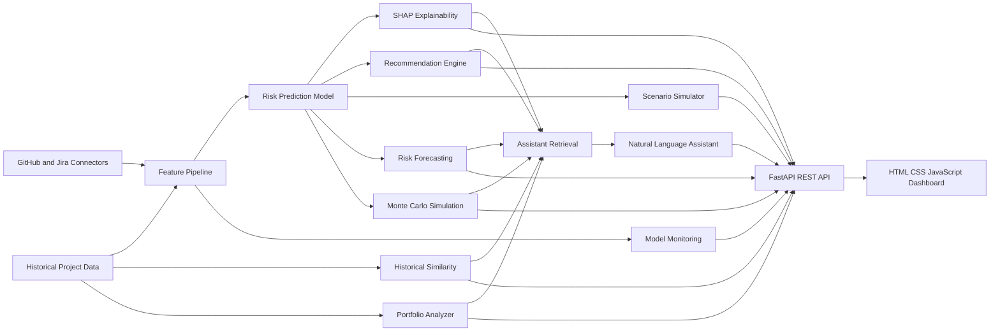

# AI Project Intelligence Platform

A production-grade portfolio project for project risk prediction, explainability, forecasting, probabilistic delivery simulation, historical matching, scenario planning, portfolio command-center analytics, natural-language analysis, and MLOps monitoring.

## Architecture



## Current Capabilities

- Risk prediction with Random Forest classifier.
- SHAP TreeExplainer explanations at project and portfolio level.
- Prescriptive recommendation engine using counterfactual rescoring.
- GitHub and Jira ingestion layer with normalized engineering metrics.
- Interactive what-if simulator.
- Risk timeline forecasting with pluggable forecaster interface.
- Optional Prophet, XGBoost, and LSTM adapter files with graceful fallbacks.
- Monte Carlo deadline simulation with P50/P80/P90 and probability curves.
- Historical project matching using cosine, nearest-neighbor, or embedding-style similarity.
- Natural-language project assistant with retrieved-context-only answers and citations.
- Advanced Scenario Lab for Scenario A/B/C comparison.
- Portfolio Risk Command Center with prioritization and heatmaps.
- Data drift and model monitoring with PSI, KS statistic, KL divergence, target drift, prediction drift, and alert generation.
- Unit tests for advanced engines and API contracts.

## Updated Folder Structure

```text
deadline_warning_project/
|-- index.html
|-- dashboard_app.js
|-- requirements.txt
|-- README.md
|-- data/
|   |-- projects.csv
|   |-- projects_scored.csv
|   |-- projects_scored.json
|   |-- shap_values.json
|   |-- recommendations.json
|   |-- engineering_metrics.json
|   |-- normalized_engineering_features.json
|   |-- advanced_feature_examples.json
|   `-- performance_benchmarks.json
|-- charts/
|   |-- shap_importance.png
|   |-- dashboard_ai_platform_screenshot.png
|   |-- advanced_command_center_screenshot.png
|   |-- risk_forecast.png
|   `-- monte_carlo_delivery.png
|-- models/
|   `-- delay_model.pkl
|-- src/
|   |-- explainability.py
|   |-- recommendation_engine.py
|   |-- scenario_simulator.py
|   |-- github_connector.py
|   |-- jira_connector.py
|   |-- feature_pipeline.py
|   |-- serve_dashboard.py
|   |-- generate_advanced_artifacts.py
|   |-- forecasting/
|   |   |-- forecaster.py
|   |   |-- prophet_model.py
|   |   |-- lstm_model.py
|   |   `-- xgboost_model.py
|   |-- monte_carlo/
|   |   `-- simulator.py
|   |-- similarity/
|   |   `-- historical_similarity.py
|   |-- assistant/
|   |   |-- project_assistant.py
|   |   |-- retrieval.py
|   |   `-- prompt_templates.py
|   |-- scenario_lab/
|   |   `-- simulator.py
|   |-- portfolio/
|   |   `-- analyzer.py
|   `-- monitoring/
|       |-- drift_detector.py
|       `-- model_monitor.py
`-- tests/
    `-- test_advanced_features.py
```

## Dependencies

Core dependencies:

```text
pandas, numpy, scikit-learn, matplotlib, seaborn, fastapi, uvicorn,
requests, shap, pydantic
```

Advanced optional dependencies declared for future production integrations:

```text
openai, langchain, xgboost
```

Install:

```bash
pip install -r requirements.txt
```

## Running The Platform

```bash
python src/generate_data.py
python src/train_model.py
python src/backtest.py
python src/explainability.py
python src/recommendation_engine.py
python src/feature_pipeline.py
python src/generate_advanced_artifacts.py
python src/serve_dashboard.py
```

Open:

```text
http://localhost:8000/
```

During verification, a clean server was also run on:

```text
http://127.0.0.1:8010/
```

## API Documentation

| Method | Endpoint | Purpose |
|---|---|---|
| GET | `/api/projects` | Returns scored projects, SHAP payload, and recommendations. |
| GET | `/api/explanations?project_id=1` | Project SHAP explanation. |
| GET | `/api/recommendations?project_id=1` | Ranked counterfactual recommendations. |
| POST | `/api/scenario` | Single what-if simulation. |
| GET | `/api/engineering-metrics` | GitHub/Jira normalized metrics. |
| GET | `/api/sync?owner=o&repo=r` | Run GitHub/Jira ingestion. |
| GET | `/api/forecast?project_id=1&horizon_weeks=4&model=xgboost` | Risk timeline forecast. |
| GET | `/api/monte-carlo?project_id=1&simulations=1000` | Delivery probability simulation. |
| GET | `/api/similar-projects?project_id=1&top_n=5&algorithm=cosine_similarity` | Historical similarity search. |
| POST | `/api/assistant` | Natural-language project assistant. |
| POST | `/api/scenario-lab` | Multi-scenario comparison. |
| GET | `/api/portfolio` | Portfolio command-center analytics. |
| GET | `/api/drift?simulate_drift=true` | MLOps drift and model health report. |

## Example Responses

Risk forecast:

```json
{
  "project_id": 1,
  "current_risk": 78.9,
  "forecast": [
    {"week": 1, "risk": 79.0, "confidence_lower": 71.0, "confidence_upper": 87.0},
    {"week": 2, "risk": 79.1, "confidence_lower": 67.8, "confidence_upper": 90.4}
  ],
  "risk_trend": "stable",
  "predicted_high_risk_date": "2026-07-06"
}
```

Monte Carlo:

```json
{
  "simulations": 1000,
  "expected_delay_days": 14.2,
  "delivery_probability": 0.72,
  "p50_completion": "2026-08-15",
  "p80_completion": "2026-08-23",
  "p90_completion": "2026-08-29"
}
```

Historical matching:

```json
{
  "project_id": 1,
  "similar_projects": [
    {"project_name": "Project Atlas", "similarity_pct": 91.4, "outcome": "Finished 13 days late"}
  ],
  "insight": "Projects with >85% similarity finished late 71% of the time."
}
```

Assistant:

```json
{
  "question": "Why is this project risky?",
  "response": "Project #1 is High risk because schedule gap and scope pressure are the primary drivers.",
  "sources_used": ["project_metrics", "shap_explanations", "risk_forecast"]
}
```

Drift warning:

```json
{
  "feature": "sprint_velocity",
  "psi": 0.34,
  "ks_statistic": 0.22,
  "status": "critical",
  "recommendation": "retrain model"
}
```

## Visual Artifacts

- `charts/advanced_command_center_screenshot.png`
- `charts/dashboard_ai_platform_screenshot.png`
- `charts/shap_importance.png`
- `charts/risk_forecast.png`
- `charts/monte_carlo_delivery.png`

## Performance Benchmarks

Measured locally against FastAPI on `http://127.0.0.1:8010`:

| Endpoint | Latency |
|---|---:|
| forecast | 139.3 ms |
| monte_carlo | 55.4 ms |
| similarity | 36.7 ms |
| portfolio | 58.2 ms |
| drift | 50.6 ms |
| assistant | 201.6 ms |
| scenario_lab | 1324.8 ms |

Scenario Lab is slower because it runs multiple model rescoring and explanation paths.

## Resource Requirements

Local demo:

- Python 3.10+
- 4 GB RAM minimum, 8 GB recommended
- 1 CPU core is enough for demo mode
- No GPU required
- OpenAI API key optional
- GitHub/Jira credentials optional

Production deployment:

- FastAPI app behind Uvicorn/Gunicorn
- Scheduled ingestion job for GitHub/Jira
- Object storage for model artifacts and generated reports
- Persistent database for project snapshots
- Background worker for Monte Carlo and Scenario Lab jobs
- Monitoring alerts wired to Slack, email, or incident tooling

## Deployment Instructions

Local:

```bash
pip install -r requirements.txt
python src/serve_dashboard.py
```

Container-ready command:

```bash
uvicorn src.serve_dashboard:app --host 0.0.0.0 --port 8000
```

Recommended cloud shape:

- API: FastAPI service container
- Static dashboard: served by FastAPI or CDN
- Jobs: scheduled worker for sync, monitoring, and retraining checks
- Secrets: environment variables or cloud secret manager
- Observability: request logs, endpoint latency, drift alerts, model version metadata

## Future Scalability Considerations

- Store historical project snapshots in Postgres or BigQuery instead of CSV.
- Move Monte Carlo and Scenario Lab to async background tasks for 10k+ simulations.
- Register model versions with MLflow or a cloud model registry.
- Add authenticated API access and role-based dashboard views.
- Replace fallback forecast simulation with trained XGBoost/Prophet/LSTM models once weekly risk snapshots are available.
- Add vector database retrieval for the assistant as project documentation grows.
- Add CI pipeline for tests, linting, and artifact generation.

## Verification

```bash
node --check dashboard_app.js
python -B -m unittest discover -s tests -v
python -B src/generate_advanced_artifacts.py
```

Latest test run: 8 tests passed.
